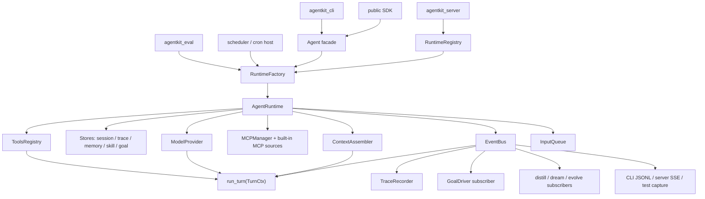

# Alfred Runtime Composition Architecture

Date: 2026-06-15
Status: design-approved
Parent spec: docs/specs/2026-06-15-alfred-design.md
Decision log: docs/decisions/2026-06-15-runtime-composition-decisions.md
Audit input: /Volumes/data/User/wayne/Code/alfred/docs/research/2026-06-15-toy-implementation-audit.md

## Overview

This design turns Alfred's prototype-shaped modules into a real runtime architecture. The
kernel turn loop is kept small, but a new session-level `AgentRuntime` owns composition:
event bus, stores, tool registry, MCP sources, bound subsystem tools, trace recording, goal
continuation, lifecycle subscribers, and shutdown.

A capability is no longer considered shipped because a class exists. It is shipped only when
it is reachable through a public entry path, emits observable state, and has entry-path proof.
During the migration slice, public `Agent` and CLI paths are valid proof points; once
`AgentRuntime` lands, new runtime capabilities must pass through that owner.

Current milestone boundary: this design is for the backend `agentkit` runtime. TUI/frontend
consumption is intentionally absent until the separate frontend milestone lands. An event or
hook is not toy merely because no TUI renders it yet; it is real for the backend milestone when
the runtime emits it on the canonical bus and a backend-facing outlet or test can observe it.

## Problem Frame

The audit found that Alfred has a working kernel and many useful library pieces, but lacks a
single owner that assembles them. This produces toy behavior:

| Toy signal | Current symptom | Architecture answer |
|---|---|---|
| Not reachable from main entry | Trace recorder, MCP manager, goal driver, subagent tools, memory tools, config tools, and Ring-3 engines are manually constructed in tests | `AgentRuntime` builds and binds them once |
| Manual object test only | Direct e2e tests call stores and engines without proving CLI/SDK/server behavior | Entry-path tests become the done threshold |
| Mock-only proof | Eval and several subsystem tests prove only shape | Runtime returns real `trace_id`; eval separates mock harness tests from live profile proof |
| Placeholder behavior | Distill writes static skill text; evolve appends a comment; dream exact-dedups files only | Mark prototype-only until connected to runtime events, trace batches, and proposal lifecycle |
| Declared affordance without tool wiring | Bundled skills mention tools not in the default registry | Register bound tools only when backing state exists, otherwise omit or downgrade the skill affordance |

## Architecture

### Layering

| Layer | Owns | Must not own |
|---|---|---|
| `run_turn()` | One turn: assemble messages, call provider, dispatch tools, enforce permission, emit lifecycle events | Store construction, MCP connection, goal loops, trace lifecycle, server or eval policy |
| `AgentRuntime` | One session/thread runtime: bus, stores, registries, tool sources, subscribers, lifecycle, continuation queue, cleanup | HTTP semantics, CLI formatting, benchmark aggregation |
| Entry consumers | CLI, SDK facade, server, cron, eval | Duplicated runtime assembly |

### Event Visibility Phases

| Phase | Required proof | Not required yet |
|---|---|---|
| Backend runtime | Runtime emits typed events on one `EventBus`; SDK/CLI/server/eval tests can subscribe or capture frames | TUI rendering |
| TUI/frontend | TUI consumes the same event frames and renders lifecycle, streaming, tool, and permission state | New backend event schema |

The first phase is the current repo's responsibility. The second phase follows after the TUI
frontend exists.

## Runtime Lifecycle

### 1. Build

`RuntimeFactory` normalizes inputs and constructs `AgentRuntime`.

| Input | Rule |
|---|---|
| `AgentConfig` | Single pydantic SSoT. Unknown fields fail at startup. |
| `cwd` / `alfred_home` | Resolve `project_id` once and pass to all project-scoped stores. |
| Provider | Build from config or injected SDK object. Fusion remains a `ModelProvider`. |
| Stores | Use injected stores when supplied, otherwise build configured/default stores under `ALFRED_HOME`. |
| Tool registry | Start empty, then register local built-ins, built-in MCP sources, configured MCP tools, and bound subsystem tools in a deterministic order. |
| Event bus | One bus per runtime session. Consumers subscribe to this bus, not to ad hoc copies. |

### 2. Start Session

`AgentRuntime.start()` is idempotent and runs before the first task.

1. Resolve instructions, memory prefetch, and skill L0 cards.
2. Connect declared MCP sources, including built-in MCP sources.
3. Register all tools and compute the final tool list.
4. Build the frozen prefix from the final tool list and context blocks.
5. Create or resume the session record.
6. Attach subscribers: trace recorder factory, goal driver, skill-used recorder, optional
   Ring-3 engines, and event outlets.
7. Emit `session_start` with a manifest that includes instructions, memory, skills, tools,
   MCP sources, store paths, and resolved permission layers.

A declared source that cannot be constructed fails here unless it is explicitly optional. The
runtime must not silently omit a declared tool source or store.

### 3. Run External Task

Each external task starts a trace and then feeds the first user message into the runtime input
queue.

1. Start a new trace with `session_id`, `project_id`, task text, active skills, and agent role.
2. Attach that trace to the bus for the task span.
3. Dequeue input and call `run_turn(TurnCtx, message)`.
4. Persist new session messages after each turn.
5. Let `turn_end` subscribers enqueue synthetic inputs, such as goal continuation.
6. Continue until the queue is empty, a stop state occurs, or an autonomy/permission gate blocks.
7. Return a result that includes `trace_id`, final message, history, usage, tool results, and
   stop reason.

The kernel loop still performs exactly one turn at a time. Multi-turn autonomy is a runtime
policy over the input queue.

### 4. Close

`AgentRuntime.close()` emits `session_end`, drains or cancels supervised subscriber tasks,
closes MCP sessions, closes stores that own connections, and prevents new turns. Server and cron
hosts must call it during shutdown.

## State Ownership

| State | SSoT owner | Readers | Writers |
|---|---|---|---|
| Conversation messages | Session store plus in-memory runtime history during active session | Runtime, server, eval, future TUI | Runtime only |
| Execution trace | Trace store | Distill, evolve, dream, eval, diagnostics | Trace recorder and explicit verifier/user annotation paths |
| Memory core persona/user | Memory provider global core files | Context assembly | Human or memory tools when bound |
| Memory facts | Memory provider project facts/index | Context assembly, dream, memory tools | Memory tools, dream |
| Skill content and versions | Skill files and `.versions/` | Context assembly, skill tools, distill/evolve proposal landing | Skill writer, human edits |
| Goal state | Goal store keyed by thread/session lineage | Goal driver, goal tools, context assembly | Goal tools and goal driver suspension states |
| Tool registry | Runtime-owned `ToolsRegistry` | Provider serialization, dispatch, manifests | Runtime startup only |
| MCP sessions | Runtime-owned `MCPManager` | MCP proxy handlers | Runtime startup/close |
| Event stream | Runtime-owned `EventBus` | CLI JSONL, server SSE, trace recorder, subscribers | Kernel loop, scheduler, subsystem emitters |

No other component may keep a second semantic copy of these states. Views and caches must be
reconstructible from the SSoT owner.

## Tool Registration

Tool registration is deterministic and conditional on backing state.

| Tool family | Registration condition | Handler binding | Permission bucket |
|---|---|---|---|
| Local safe built-ins | Always | Pure local handlers: `hashread`, `hashedit`, `write_file`, `list_dir`, `bash`, `web_fetch` | Existing buckets |
| `fff` | Built-in MCP source starts successfully | MCP adapter exposes the in-box search tool as `fff` | `read` |
| User MCP tools | Configured MCP source starts successfully | MCP adapter proxies `call_tool()` through live session | `mcp` by default |
| Skill tools | Skill catalog exists | `skills_list(catalog)`, `skill_view(catalog, bus, session_id)` | `read` |
| Memory tools | Memory provider exists | `memory_append/search/replace(provider, runtime memory context)` | `memory` or `write` by operation |
| Goal tools | Goal store exists | Bound goal store plus current thread id | `goal` |
| Subagent/handoff tools | Spawner exists | Bound `Spawner(provider, tools, budget, bus, trace)` | `spawn` |
| Config self-edit | Config path and allowed root are known | Bound config path/root, protected by permission and autonomy | `write` |

If a bundled skill advertises a tool that is not registered, that skill must be downgraded
or omitted from active L0. Runtime must not advertise unreachable tool affordances.

### Built-in `fff` MCP Source

The active design for `fff` is an in-box MCP tool source:

1. Runtime starts the built-in `fff` source without user config.
2. The source exposes a search tool through the same MCP-to-`ToolsRegistry` adapter used by
   external MCP servers.
3. The visible Alfred tool remains `fff` for compatibility, but the implementation path is MCP.
4. Any native executable or index remains hidden inside the built-in source.
5. The direct `agentkit_fff_<platform>` companion locator is removed from the active contract.
6. `rg` or Python fallback may exist only as degraded behavior with an explicit warning; it does
   not satisfy the native/built-in `fff` contract.

## Trace Architecture

Trace recording is not optional for runtime paths that claim learning, eval, or debug output.

| Event | Required payload for trace usefulness |
|---|---|
| `turn_start` | `session_id`, `turn_id`, `trace_id`, agent id |
| `pre_tool` | tool name, structured args reference, budget before/after when known, monotonic timestamp |
| `post_tool` | result status, result reference or digest, error type, latency, budget after |
| `skill_used` | skill name and version |
| `handoff` | parent trace id, child trace id, payload reference |
| `turn_end` | assistant message reference, usage, stop reason |

`TraceRecorder` starts at external task start, not as a test-only helper. It writes steps and
annotations from the runtime bus and exposes its `trace_id` through the public result. Eval and
Ring-3 learning consumers must reject missing `trace_id` instead of accepting `None`.

## Goal Continuation

Goal self-continuation is owned by runtime, not by the kernel loop.

1. Goal tools mutate the goal store.
2. `session_start` injects active goal state into the frozen prefix.
3. `turn_end` lets `GoalDriver` evaluate the active goal, autonomy gate, no-progress detector,
   and budget.
4. If continuation is allowed, the driver enqueues a synthetic user input through the runtime
   input queue.
5. If blocked, the driver sets a loud status: `paused`, `blocked`, `budget_limited`, or
   `no_progress`, and emits a goal suspension event.

There is one input path. User messages and synthetic continuation messages both enter
`run_turn()` through the runtime queue.

## MCP Architecture

`MCPManager` is a runtime resource.

| Concern | Design |
|---|---|
| Config | `AgentConfig` gains an `mcp` list of component specs. Built-in MCP sources are declared by runtime defaults, not user config. |
| Transport | Stdio is required first. HTTP can follow the existing research design. |
| Lifetime | Sessions stay open for the runtime lifetime because tool handlers close over live MCP sessions. |
| Failure | Required configured servers fail at startup. Optional servers warn and do not register tools. |
| Naming | Built-in Alfred-owned tools keep stable names. External tools use `server.tool` unless a later decision adds explicit aliases. |
| Permission | External MCP defaults to `ask`/headless deny through the `mcp` bucket unless config narrows or allows. |
| Close | Runtime owns `MCPManager.close()` at session shutdown. |

## Server And SSE

The server is a runtime host, not an event replay buffer.

| Route | Runtime behavior |
|---|---|
| `POST /turn` | Create or fetch a runtime by session/thread id, enqueue prompt, return final result metadata. |
| `GET /events` | Subscribe to the runtime bus stream live. Optionally replay persisted frames first, then continue live. |
| Shutdown | Close all active runtimes. |

`EventHub` may remain as a bounded replay cache, but the canonical source is the runtime
`EventBus`. A server test must prove `/events` can receive events while a turn is still running,
not only after `/turn` has returned.

## Eval Architecture

Eval is a public-entry consumer that runs real runtimes.

| Requirement | Design |
|---|---|
| Freshness | One fresh runtime per rollout unless the experiment explicitly tests resume. |
| Trace IDs | Every rollout stores a non-null `trace_id`; missing trace is a harness error. |
| Artifacts | Write durable `findings.json`, `rollouts.jsonl`, and `report.md` under a results directory. |
| Mock tests | Mock-provider tests prove mechanics only. They must not be labeled live eval proof. |
| Live profile | Live provider runs require real config, usage, trace IDs, and report artifacts. |
| Parity | The existing parity guard remains mandatory so a delta is attributable to the configured axis. |

## Ring-3 Runtime Status

| Subsystem | Runtime status after this design | Shipped threshold |
|---|---|---|
| Distill | Prototype-only until subscribed to `idle` or `tick`, reading real trace batches, producing proposal lifecycle records | Entry-path trace batch creates a held proposal with source trace IDs |
| Dream | Prototype-only as exact duplicate janitor until subscribed to session/idle lifecycle and operating on real memory facts | Runtime task creates memory input, dream consolidates, index reflects change |
| Evolve | Prototype-only until it generates real variants, scores against replay/eval sets, and lands through gated proposal flow | Failure trace set produces a candidate, scorer runs, accepted merge writes a version |
| Fusion | Connected as provider, but cross-vendor proof required for stronger claim | Live forced cross-vendor run with useful aggregation or explicit downgraded claim |
| Handoff | Library surface until bound spawn/handoff tools are runtime-registered | Model-initiated `spawn_subagent` from public entry path writes parent/child traces |
| Goal | Store/driver surface until bound tools and queue continuation are runtime-registered | Public entry path sets a goal and auto-continues under gates |
| MCP | Library surface until configured by `AgentConfig` and started by runtime | Public entry path calls a discovered MCP tool |

## Prototype Downgrade And Deletion Rules

The runtime design intentionally removes ambiguity between prototype and shipped feature.

| Surface | Action |
|---|---|
| Direct `fff` companion package path | Delete from active runtime after built-in MCP source exists. Keep only internal native plumbing if needed. |
| Bundled skills with unreachable tools | Omit from active L0 or rewrite their affordance until tools are bound by runtime. |
| `judge_failure` fusion config | Implement judge behavior or delete the field before calling it supported. |
| Refundable budget branch | Keep only if a real refundable tool is added; otherwise delete the branch. |
| Non-tool registries | Route construction through them or mark them mechanism-only. Do not present unused registries as features. |
| Context compression functions | Wire them at budget/context boundaries or keep them out of the active feature list. |
| Cron helper | Treat as direct helper until hosted by the server scheduler loop. |

## Entry-Path Verification

Every runtime-connected feature needs at least one public path proof.

| Feature | Required proof |
|---|---|
| Runtime composition | `Agent().run()` emits one bus stream, returns trace id, persists session when store configured |
| CLI | `alfred chat --output-format stream-json` emits live JSONL with trace id and tool lifecycle frames |
| Server | `/turn` plus live `/events` reconstructs the turn from runtime bus frames when the server host is in scope |
| Trace | A public `Agent` or CLI tool call writes trace steps with result status and latency |
| Goal | Public path sets a goal, injects active goal at session start, and self-continues only when gates allow |
| MCP | Configured stdio MCP tool appears in the runtime tool list and is callable by the model |
| Built-in `fff` | Runtime registers `fff` from built-in MCP and reports native/fallback status loudly |
| Eval | `alfred eval run` writes durable artifacts with non-null trace ids |
| Distill/dream/evolve | Runtime event triggers them with real stores, or docs say prototype-only |

TUI visual proof is intentionally excluded from this backend table. The TUI milestone should reuse
these event frames rather than inventing a second event contract.

## E2E Verification Contract

This contract is backend-only and intentionally executable before the TUI exists. It must be run
by `wayne-verify`, using the main worktree `.env` file for real LLM credentials:
`/Volumes/data/User/wayne/Code/alfred/.env`. The verification runner maps `LLM_API_KEY` to
`OPENAI_API_KEY` for Alfred's `env_key` provider config and passes `LLM_BASE_URL` through
unchanged as an OpenAI-compatible `/v1` `--base-url`. The current gateway model list was checked
through `/v1/models`; use `openai/mimo-v2.5-pro` for this contract. Secrets must never be copied
into repo files or logs.

| # | User path | Env: process | Env: data | Env: entrypoint | Observable (pass = ?) | Status |
|---|---|---|---|---|---|---|
| 1 | Developer asks Alfred CLI to use `hashread` on a real file while trace recording is enabled. | No daemon; one CLI process. Real LiteLLM provider via main worktree `.env`. | Temp file containing `ALFRED_REAL_TRACE_CONTENT`; temp `trace.db`. | `uv run alfred chat "Use hashread..." --provider litellm --model openai/mimo-v2.5-pro --base-url "$LLM_BASE_URL" --env-key OPENAI_API_KEY --tool-choice hashread --trace-db "$TRACE_DB" --output-format json` | JSON final message includes `ALFRED_REAL_TRACE_CONTENT`; `tool_trace[0].name == "hashread"`; result payload has non-empty `trace_id`; trace DB row for that id has a `hashread` step with the temp file path. | ✅ evidence: `/var/folders/b6/q7tnsx1974gb0jhjkj023ltw0000gn/T/alfred-openai-runtime-e2e-vfwjmiig/row1-hashread-json`; trace_id `eb1d00a6-10cc-4c80-b6fd-85a373663b1d` |
| 2 | Developer asks Alfred CLI for a streamed real LLM answer while trace recording is enabled. | No daemon; one CLI process. Real LiteLLM provider via main worktree `.env`. | Temp `trace.db`. | `uv run alfred chat "Reply exactly..." --provider litellm --model openai/mimo-v2.5-pro --base-url "$LLM_BASE_URL" --env-key OPENAI_API_KEY --trace-db "$TRACE_DB" --output-format stream-json` | JSONL contains at least one `stream_delta`; final `result` frame includes the requested token and non-empty `trace_id`; trace DB row exists for that id. | ✅ evidence: `/var/folders/b6/q7tnsx1974gb0jhjkj023ltw0000gn/T/alfred-openai-runtime-e2e-vfwjmiig/row2-stream-json`; trace_id `b7b1f546-05ff-473e-883e-9fd9b0a801a0` |

### Future E2E Rows

The following are not part of the current backend reality slice and must not block this contract:

| Future row | Why deferred |
|---|---|
| Server live SSE runtime stream | Server runtime registry has not been implemented yet. Current backend proof is CLI/SDK observable. |
| MCP public Agent slice | Planned after trace substrate; requires config/runtime source wiring. |
| Goal continuation slice | Planned after trace substrate; requires backend input queue continuation. |
| Eval artifacts slice | Planned after CLI trace opt-in; requires durable results directory support. |

## Migration Path

1. Introduce `AgentRuntime`, `RuntimeFactory`, and a runtime result shape carrying `trace_id`.
2. Move bus, budget, permission, context assembly, and tool registry ownership from `Agent.run()`
   into runtime.
3. Extend config for MCP and runtime-owned stores without changing existing simple `Agent()` usage.
4. Bind subsystem tools conditionally and update bundled skill L0 injection to match registered tools.
5. Replace direct `fff` registration with built-in MCP source registration.
6. Wire trace recorder and event payload enrichment.
7. Add goal input queue continuation.
8. Convert server to runtime registry plus live SSE.
9. Convert eval to runtime results and durable artifacts.
10. Mark or remove remaining prototype surfaces before claiming them as shipped.

## Out Of Scope

- TUI rendering and OpenTUI work.
- Production sandboxing.
- Cross-process distributed event bus.
- Full Darwin-Godel archive for evolve.
- Hot reloading MCP tools or skills mid-session.
- A separate daemon process beyond the server host already planned.

## Sources And References

- Parent spec: `docs/specs/2026-06-15-alfred-design.md`
- Original implementation plan: `docs/plans/2026-06-15-001-feat-alfred-agent-loop-plan.md`
- Runtime composition decisions: `docs/decisions/2026-06-15-runtime-composition-decisions.md`
- Event bus research: `docs/research/kernel-event-bus.md`
- Trace research: `docs/research/store-trace.md`
- MCP research: `docs/research/mcp.md`
- Goal research: `docs/research/subsystem-goal.md`
- Handoff research: `docs/research/subsystem-handoff.md`
- Eval research: `docs/research/eval-harness.md`
- External audit input: `/Volumes/data/User/wayne/Code/alfred/docs/research/2026-06-15-toy-implementation-audit.md`
